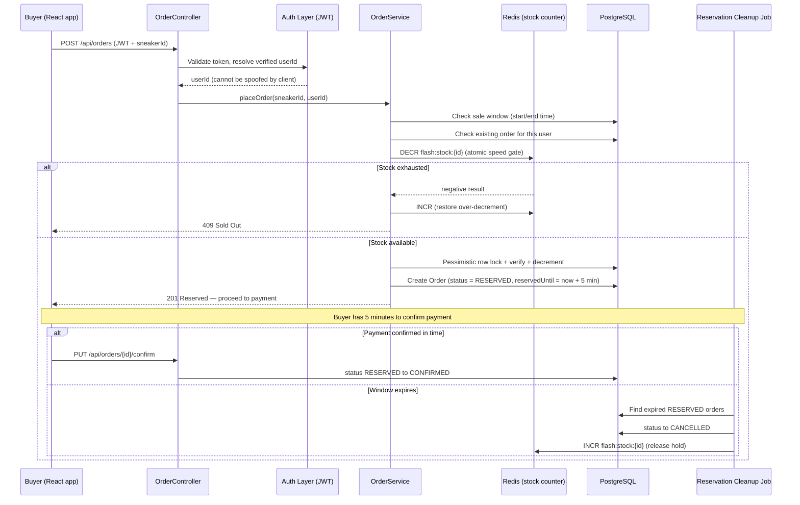
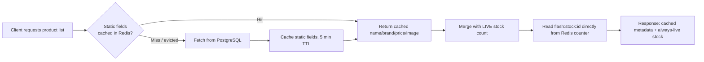

# FlashSale Engine

A production-grade backend for running high traffic flash sales, built with Spring Boot, PostgreSQL, and Redis. It handles the full lifecycle of a sneaker drop: user authentication, browsing live stock, placing an order under heavy concurrent load, and holding that order for a short payment window before it's confirmed or released. The system uses row level database locking to guarantee correctness, an atomic Redis counter to keep the checkout path fast under load, and a caching layer that keeps product pages quick without ever showing stale stock.

At the center of it is one deliberately hard question: what actually happens when 1,000 people try to buy 50 pairs of sneakers at the exact same second? Rather than assume an answer, every stage of this system was load-tested, measured, and iterated over, starting from a naive version that oversold stock by 660%, then fixed and sped up in stages: pessimistic locking, a Redis-backed fast path, response caching, authentication, and short-lived stock reservations.

---

## Aim of the Project

Flash sales (sneaker drops, ticket releases, limited restocks) are one of the more punishing concurrency problems in backend engineering: a huge burst of simultaneous writes competing for a tiny, fixed pool of inventory, where correctness (never selling more than exists) matters more than raw speed, but speed still matters, because a slow checkout under load is a correctness problem from the user's perspective.

The goal here was to build that system properly, in layers, and prove each layer's impact with real load-test numbers rather than intuition:

1. Prove the oversell bug exists under concurrency.
2. Fix it with database-level pessimistic locking.
3. Speed up the fixed system with a Redis pre-filter, without reintroducing the bug.
4. Cache read-heavy traffic without serving stale stock.
5. Attach real user identity so the system can't be trivially gamed.
6. Give buyers a genuine reservation window instead of an instant, irreversible deduction.

---

## System Workflow

### Request flow: placing an order



### Request flow: browsing the drop (`GET /api/sneakers`)



The split matters: product metadata (name, brand, price, image) changes rarely, so it's cached with a TTL and evicted only on admin edits. Stock changes on every single order, so it is **never cached** — it's read straight from the same Redis counter that `OrderService` already keeps accurate on every purchase. This avoids the two failure modes of naive caching: stale stock counts, and the overhead of evicting an entire cached object every time one volatile field inside it changes.

---

## System Design Diagram

```mermaid
flowchart TB
    subgraph Client
        FE[React + Vite Frontend]
    end

    subgraph API["Spring Boot 4.1.0 API"]
        AuthC[AuthController]
        SneakerC[SneakerController]
        OrderC[OrderController]
        AuthS[AuthService / JWT]
        SneakerS[SneakerService]
        OrderS[OrderService]
        StockS[RedisStockService]
        Sched[Reservation Cleanup Scheduler]
    end

    subgraph Redis
        Cache[(Product metadata cache<br/>TTL-based)]
        Counter[(Live stock counters<br/>flash:stock:id)]
    end

    subgraph Postgres[(PostgreSQL)]
        Users[(users)]
        Sneakers[(sneakers)]
        Orders[(orders)]
    end

    FE -->|HTTPS + JWT| AuthC
    FE --> SneakerC
    FE --> OrderC

    AuthC --> AuthS --> Users
    SneakerC --> SneakerS --> Cache
    SneakerS --> Counter
    SneakerS --> Sneakers

    OrderC --> OrderS
    OrderS --> AuthS
    OrderS --> Counter
    OrderS --> Sneakers
    OrderS --> Orders
    OrderS -.evicts.-> Cache

    Sched -->|scans every 30s| Orders
    Sched -->|releases expired holds| Counter
```

---

## The Core Problem, Proven and Fixed in Stages

Every stage below was measured under the same conditions: **1,000 concurrent virtual users competing for 50 units of stock**, via JMeter.

| Approach | Orders Created | Oversell | Avg Response Time | Error Rate | Throughput |
|---|---|---|---|---|---|
| **Naive** (no concurrency control) | 381 | **331 units oversold** | 5548 ms | 61.9% | 130.1 req/sec |
| **Pessimistic Locking** (`PESSIMISTIC_WRITE` + `@Transactional`) | 50 (exact) | 0 | 1636 ms | 95%* | 145.4 req/sec |
| **Redis Speed Gate + Pessimistic Lock** | 50 (exact) | 0 | **702 ms** | 95%* | **210.2 req/sec** |

\* A 95% error rate here is *correct*, not a fault as  with 1,000 requests competing for 50 units, 950 rejections is the expected, intended outcome. The metric to watch is that the error rate stayed identical while response time dropped ~57% and throughput rose ~45%.

**Why the Redis stage got faster without changing correctness:** in the naive-fixed version, every request including all 950 that were always going to fail, still had to acquire a database row lock before being told "sold out," serializing all 1,000 requests through one lock queue. Adding an atomic Redis `DECR` *before* the lock acquisition step means the ~950 doomed requests get rejected by a fast in-memory operation and never touch the database lock at all. Only the ~50 requests that could actually succeed pay the cost of the pessimistic lock, which is exactly the amount of lock contention the system actually needs.

**Read-path caching impact:** after adding Redis-backed response caching for product listing data, a cold `GET /api/sneakers` (Postgres round-trip) measured ~2.98s on a first request; the identical request served from cache measured ~250ms, roughly a **12x improvement** for repeated reads, with zero risk of serving stale stock once the cache/counter split was in place.

---

## Tech Stack

| Layer | Technology |
|---|---|
| Language / Runtime | Java 21 |
| Framework | Spring Boot 4.1.0 |
| Primary Database | PostgreSQL 15 |
| Cache / Fast-path Store | Redis 7 |
| Auth | JWT-based session verification |
| Build Tool | Maven |
| Frontend | React 18 + Vite |
| Containerization | Docker (Postgres, Redis) |
| Load Testing | Apache JMeter |

---

## Project Architecture

### Backend

```
src/main/java/com/flashsale/flashsale_engine/
├── config/
│   ├── DataSeeder.java              # Seeds sneakers + initializes Redis stock/cache on startup
│   ├── RedisCacheConfig.java        # JSON-serialized Redis cache manager, TTL config
│   ├── CorsConfig.java              # Allows the frontend origin to call the API
│   └── SecurityConfig.java          # JWT filter chain, public vs. authenticated routes
├── controller/
│   ├── AuthController.java          # Register / login, issues JWTs
│   ├── SneakerController.java       # 5 CRUD endpoints
│   └── OrderController.java         # Place, confirm, fetch orders
├── dto/
│   ├── SneakerRequestDTO.java / SneakerResponseDTO.java
│   ├── OrderRequestDTO.java / OrderResponseDTO.java
│   └── AuthRequestDTO.java / AuthResponseDTO.java
├── exception/
│   ├── ResourceNotFoundException.java
│   ├── ErrorResponse.java
│   └── GlobalExceptionHandler.java
├── model/
│   ├── Sneaker.java
│   ├── Order.java                   # Includes status + reservedUntil
│   ├── OrderStatus.java             # RESERVED, PENDING, CONFIRMED, CANCELLED
│   └── User.java
├── repository/
│   ├── SneakerRepository.java       # Includes findByIdWithPessimisticLock()
│   ├── OrderRepository.java         # Includes findByReservedUntilBeforeAndStatus()
│   └── UserRepository.java
└── service/
    ├── AuthService.java             # Credential checks, JWT issuance/validation
    ├── SneakerService.java          # Cached product metadata reads
    ├── OrderService.java            # Redis gate + pessimistic lock + reservation logic
    ├── RedisStockService.java       # Atomic stock counter operations (source of live truth)
    └── ReservationCleanupScheduler.java  # Expires unpaid reservations, releases stock
```

### Frontend

```
flashsale-frontend/
├── src/
│   ├── api.js                       # All backend calls
│   ├── App.jsx                      # Main page: fetch, buy flow, toasts, orders panel
│   ├── App.css                      # Drop-ticket design system
│   ├── index.css                    # Design tokens
│   └── components/
│       ├── Header.jsx               # Live clock, authenticated buyer identity
│       ├── SneakerTicket.jsx        # Product card ("drop ticket")
│       ├── CountdownTimer.jsx       # Live countdown to sale start/end
│       ├── OrdersPanel.jsx          # Order history for the logged-in buyer
│       └── Toast.jsx                # Success/error notifications
```

---

## Key Design Decisions

- **Pessimistic over optimistic locking.** Optimistic locking (`@Version`) was evaluated and rejected for this use case : under extremely high contention on a single row, retry storms from optimistic locking failures create their own overhead. A pessimistic lock, guarded by a fast Redis pre-filter so it's only ever acquired by requests likely to succeed, was the better fit.
- **Cache-aside, not write-through, for product metadata.** Simpler to reason about and safer under partial failures than trying to keep a cache in sync with every write path.
- **Stock is a live counter, never a cached value.** Anything that changes as often as stock does during a flash sale doesn't belong behind a TTL, it's read directly from Redis on every request instead.
- **Reservation over instant deduction.** An "order" isn't real until payment is confirmed. Treating a Redis/DB decrement as final the instant a request lands, before payment even happens, silently strands stock if payment fails. A time-boxed hold with an automatic release is the more honest model of what a checkout actually is.

---

## What This Project Demonstrates

- Reproducing and quantifying a race-condition bug under real concurrent load, not just describing it
- Layered concurrency control (in-memory atomic gate + database-level locking) and understanding *why* the ordering of those two matters
- Cache design that distinguishes between data that's safe to cache and data that isn't, rather than caching indiscriminately
- Reasoning about trade-offs explicitly (eviction vs. live-read, pessimistic vs. optimistic) rather than defaulting to the first solution that works